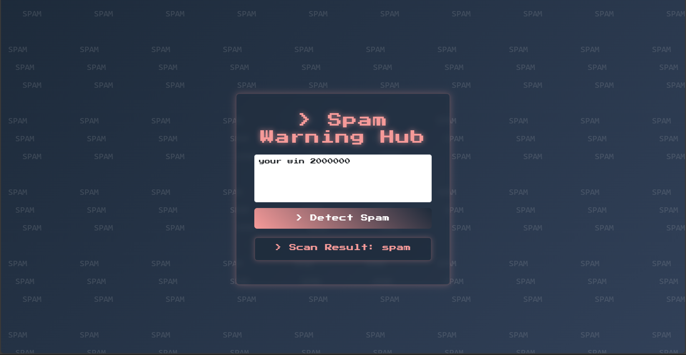

# spam-detection

📦 README.md
markdown
Copy
Edit
# 🚀 Spam Detection Web App

A fun, retro-style Flask web app to detect whether a given text message is spam or not, using an NLP machine learning model.



---

## 📌 **Features**
- 🧠 Detects spam in text using a trained classifier (`spam_classifier.pkl`)
- 🌐 Simple web interface built with Flask & Bootstrap
- 🎨 Retro aesthetic using pixel fonts & animated background
- ⚡ Fast, lightweight, and easy to deploy

---

## 🛠️ **Tech Stack**
- Python
- Flask
- Scikit-learn (or any ML library you used)
- HTML, CSS (Bootstrap)
- Pickle (for loading the trained model)

---

## 🚀 **Installation & Usage**

1️⃣ **Clone the repository**
```bash
git clone https://github.com/mohdanshif/spam-detection.git
cd spam-detection
2️⃣ Install dependencies

bash
Copy
Edit
pip install -r requirements.txt
(Make sure you have Python ≥ 3.7 and pip installed)

3️⃣ Run the app

bash
Copy
Edit
python app.py
App will be accessible at:

cpp
Copy
Edit
http://127.0.0.1:5000/
📂 Project Structure
plaintext
Copy
Edit
spam-detection/
├── app.py                # Flask application
├── spam_classifier.pkl   # Pre-trained spam detection model
├── templates/
│   └── index.html        # Frontend HTML
├── static/               # (Optional) for CSS, images
├── requirements.txt      # Python dependencies
└── README.md
⚙️ Model
The spam detection model (spam_classifier.pkl) is a pre-trained machine learning model
that uses Natural Language Processing (NLP) techniques to classify messages as spam or not spam.

📸 Screenshot

(Replace with your actual app screenshot!)

✏️ How to Use
Open the app in your browser

Enter a text message you want to check

Click Detect Spam

View the prediction result below the form

📄 License
This project is licensed under the MIT License.

🤝 Contributing
Pull requests and suggestions are welcome!
Feel free to open an issue or submit a PR.

⭐ Give a Star!
If you like this project, please ⭐ star this repo to support it!

yaml
Copy
Edit

---

If you'd like,  
✅ I can also help create:  
- `requirements.txt`  
- `.gitignore`  
- a **Dockerfile** (for deployment)  
Just let me know! 🚀
